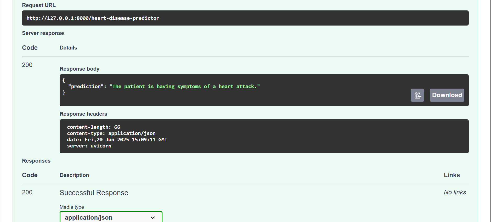

# Heart Disease Predictor API

A machine learning project to predict the presence of heart disease using clinical and demographic data, deployed using a FastAPI backend and containerized with Docker.

---

## Overview

This project builds and serves a machine learning model to predict the likelihood of heart disease based on patient information such as age, cholesterol level, chest pain type, and more. It uses a Support Vector Machine (SVM) trained on publicly available clinical data and exposes a RESTful API using FastAPI.

---

## Project Structure

```
HeartPredictionAPI/
├── main.py               # FastAPI app
├── svm_pipeline.pkl      # Trained ML pipeline
├── model_training.ipynb  # Model development notebook (optional)
├── requirements.txt      # Python dependencies
├── Dockerfile            # Docker container instructions
├── README.md             # Project documentation
├── .gitignore
└── images/               # Screenshots for API demo
```

---

## Dataset

The dataset used is [Heart Disease UCI](https://www.kaggle.com/datasets/johnsmith88/heart-disease-dataset), which includes clinical features such as:

- Age, sex, chest pain type (`cp`), resting blood pressure (`trestbps`), cholesterol (`chol`)
- Fasting blood sugar (`fbs`), ECG (`restecg`), max heart rate (`thalach`)
- Exercise-induced angina (`exang`), ST depression (`oldpeak`), number of vessels (`ca`), and thalassemia type (`thal`)

---

## Final Model

- **Algorithm**: Support Vector Machine (RBF Kernel)
- **Pipeline**: StandardScaler + SVM using `Pipeline` from scikit-learn
- **Exported As**: `svm_pipeline.pkl` using `pickle`
- **Tuned With**: `GridSearchCV`
- **Evaluated Using**: Accuracy, Precision, Recall, F1-Score, and SHAP for model explainability

---

## Local Execution (via FastAPI)

### 1. Environment Setup

```bash
conda create -n heartapi python=3.12 -y
conda activate heartapi
```

### 2. Clone the Repository

```bash
git clone https://github.com/Amaan-developpeur/HeartPredictionAPI.git
cd HeartPredictionAPI
```

### 3. Install Dependencies

```bash
pip install -r requirements.txt
```

### 4. Run the API Server

```bash
uvicorn main:app --reload
```

Visit the interactive Swagger UI at:  
📎 http://127.0.0.1:8000/docs

---

## Sample API Request

```json
{
  "age": 55,
  "sex": 1,
  "cp": 2,
  "trestbps": 130,
  "chol": 250,
  "fbs": 0,
  "restecg": 1,
  "thalach": 160,
  "exang": 0,
  "oldpeak": 1.5,
  "slope": 2,
  "ca": 0,
  "thal": 3
}
```

---

## Docker Setup

You can run the entire app in a containerized environment using Docker.

### 1. Build the Docker Image

```bash
docker build -t heart-api .
```

### 2. Run the Container

```bash
docker run -p 8000:8000 heart-api
```

Then open your browser to:  
📎 http://localhost:8000/docs

---

## API Demo

### 🔹 Swagger UI Input Form

Users can submit patient data here:


---

### 🔹 API Response with Prediction

The model returns a clear message about heart disease risk:



---

### 🔹 Terminal Running FastAPI

Server running successfully with Uvicorn:


---

## Requirements

See `requirements.txt` for exact versions. Core dependencies include:

- `fastapi`
- `uvicorn`
- `pandas`
- `scikit-learn`
- `numpy`
- `python-multipart`

---

## License

This project is released under the MIT License.

---

## Author

**Mohammed Amaan**  
📎 [GitHub: Amaan-developpeur](https://github.com/Amaan-developpeur)
